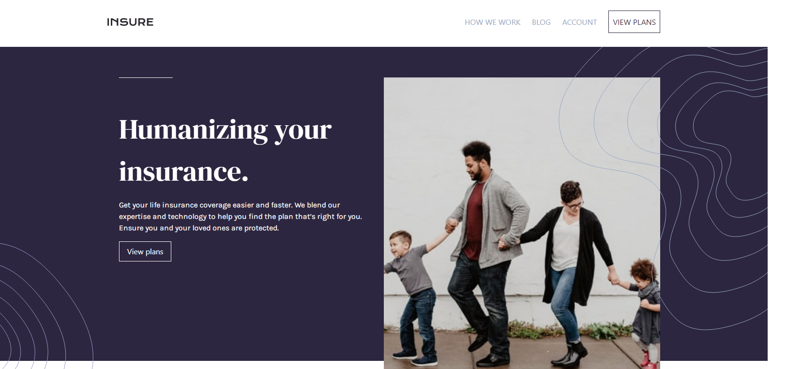

# Frontend Mentor - Insure landing page solution

This is a solution to the [Insure landing page challenge on Frontend Mentor](https://www.frontendmentor.io/challenges/insure-landing-page-uTU68JV8). Frontend Mentor challenges help you improve your coding skills by building realistic projects. 

## Table of contents

- [Overview](#overview)
  - [The challenge](#the-challenge)
  - [Screenshot](#screenshot)
  - [Links](#links)
- [My process](#my-process)
  - [Built with](#built-with)
  - [What I learned](#what-i-learned)
  - [Continued development](#continued-development)


## Overview

### The challenge

Users should be able to:

- View the optimal layout for the site depending on their device's screen size
- See hover states for all interactive elements on the page

### Screenshot




### Links

- Solution URL: [Solution Github Rep Link](https://github.com/qayoommunawar/Responsive-Insure-Landing-Page-Tailwind-CSS)
- Live Site URL: [Github Live Site](https://qayoommunawar.github.io/Responsive-Insure-Landing-Page-Tailwind-CSS/)

## My process

### Built with

- Semantic HTML5 markup
- Tailwind CSs
- Mobile-first workflow

### What I learned

Almost 99% of CSS is Tailwind, aprat from CSS Resets.


```html
<button type="button" 
        class=" bg-transparent focus:outline-none focus-visible:ring-2 focus-visible:ring-offset-2 
        focus-visible:white 
        border border-white p-4 py-2 text-white">
          How we work
      </button>
```

### Continued development

My next target is to learn & practice proper Tailwind build from inliner, so that my CSS is less messy and 
Webiste is build ready.


